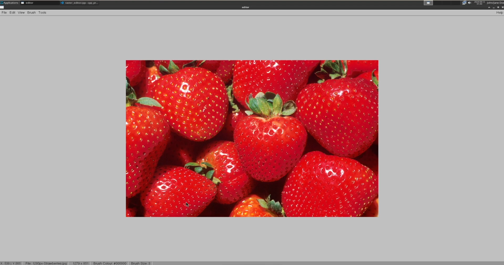

## Simple Raster Image Editor 

### Collaborators:
- Arun Alex
- Julian France

### Video Presentation
Here is a video presentation for our project, including background motivation,
challenges faced, and a demonstration of the software.
[](https://www.youtube.com/watch?v=YRV_4dGv_FY "Raster Image Editor")

### How to download/run
- Go to the [Releases](https://github.com/arunalex62/raster-image-editor/releases) page and download the latest release.
- Please be sure to follow the requirements on the release to run the program.

### Installation Steps (if building the program from source):
    Let $TOP_DIR denote the directory containing this README file.
    Let $INSTALL_DIR denote the directory into which this
    software is to be installed.
    To build and install the software, use the commands:
```
cd $TOP_DIR
cmake -H. -Btmp_cmake -DCMAKE_INSTALL_PREFIX=$INSTALL_DIR
cmake --build tmp_cmake --clean-first --target install
```

#### To run a demonstration, use the commands:
```
$INSTALL_DIR/bin/demo
```

### The program can import/export image files in the following formats:
1. PNG
2. JPG/JPEG
3. BMP
4. PPM

**Note: If you are running this program remotely through command line
(such as through SSH), please ensure X11 is enabled to see the GUI.**
